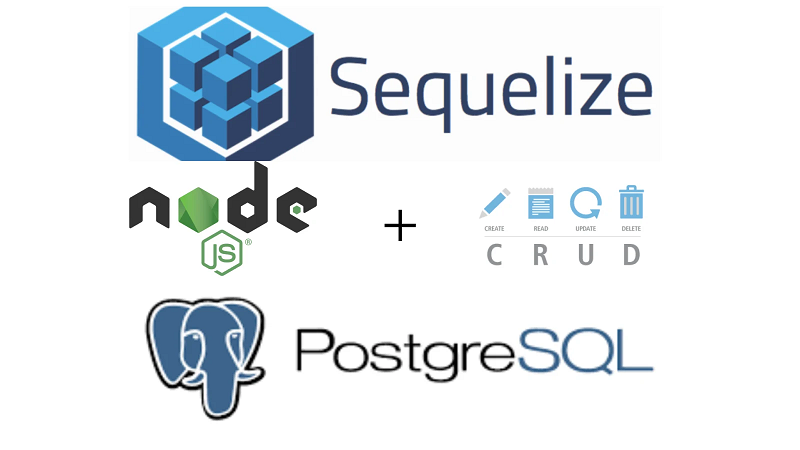

# Projeto: Crud de Usuário Com SQL

Fazer um CRUD simples de usuário com express, Sequelize e Postgres

### Utilidade:

- Aprender a criar conexão com o banco

#### Material:

- Express
- Sequelize
- Postgres

#### Pré-requisito:

 Ter o postgres instalado no docker e estar funcionando.

#### Modo de uso:

1. Abra um terminal ( cmd/propt de comando )
2. Clone o repositório ( git clone https://github.com/RobMota/crud-postgresql-nodejs.git ) em algum local de preferência
3. Acesse a pasta ( cd crud-postgresql-nodejs )
4. E digite os comandos abaixo:

- `npm install`
- `npm start`
